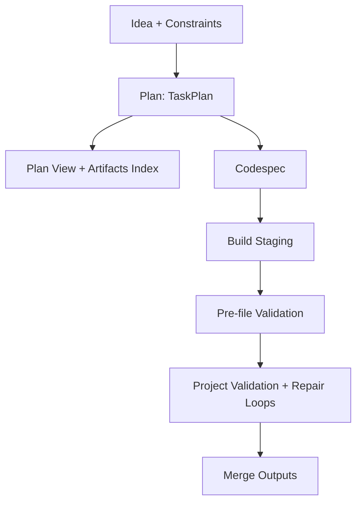

# CRPB — Context Recursive Project Builder

CRPB is a general‑purpose, language‑agnostic, spec‑driven project builder. It turns a natural‑language idea plus constraints into a hierarchical plan, a neutral CodeSpec, and a deterministic build with holistic validation and repair loops.

CRPB is not a “code generator for one stack.” It builds anything: a single algorithm, a data pipeline, a CLI tool, a website, a set of configs, or even a long text artifact. The system remains neutral and defers technology choices to the plan/spec or file path inference.

---

## Why CRPB

- **General‑purpose**: Works for any type of project (algorithms, data, content, config, apps).
- **Language‑agnostic**: No default language assumptions; `language` is explicit or inferred from file paths.
- **Spec‑driven**: Planning produces a hierarchical TaskPlan; execution produces/consumes a neutral CodeSpec.
- **Context‑rich**: Every step is guided by structured context (node plans, socratic notes, artifacts, validations).
- **Deterministic build**: Files are generated in a stable order, with pre/post validation and repair loops.
- **Holistic validation**: Project‑level checks ensure features are integrated and actually used, not just implemented.

---

## Architecture Overview

CRPB has three major phases:

1. **Plan**
   - Generates a hierarchical `TaskPlan` (`runs/<run>/plan/plan.json`).
   - Embeds rich per‑node context (`node_plan`, `meta.socratic`, `meta.path`).
   - Exports a clean `view` (human‑first parent→children tree, no ids/deps noise).
   - Builds an `artifacts.index` mapping producers/consumers for integration.
   - Validates the plan (`plan_validation.json`).

2. **CodeSpec**
   - Produces a language‑neutral file blueprint: `runs/<run>/plan/codespec.json`.
   - Describes files (`path`, optional `language`), `functions`, `exports`, `content`, `entrypoint`, etc.
   - Can be enriched progressively or refined before build.

3. **Build**
   - Generates files to a staging area, validates per‑file and project‑level, performs repair loops, and then merges to outputs.
   - Writes validation reports under `runs/<run>/validations/` and final files to `runs/<run>/outputs/`.



---

## Key Concepts

- **TaskPlan (planning)**
  - Hierarchical tasks with `children` (parents orchestrate; leaves implementable).
  - Each node has `node_plan` (intent, acceptance_criteria, test_plan, etc.) and `meta.socratic` (questions + monologue).
  - `view.roots` provides a clean parent→children tree for humans/tools.
  - `artifacts.index` captures producers/consumers to enforce integration.

- **CodeSpec (specification)**
  - Per‑file blueprint that remains language‑neutral.
  - Fields: `path`, optional `language`, `purpose`, `description`, `functions`, `exports`, `content`, `entrypoint`, etc.
  - Enables deterministic generation without stack bias.

- **Validation & Repair**
  - `validate_taskplan_general` checks structure, DAG (id/dep), node_plan presence, and artifact shapes/coverage.
  - Project‑level validation flags unused exports, missing producers/consumers, and plan/spec mismatch (capabilities not surfaced or orphan features).
  - Pre‑ and post‑merge repair loops attempt targeted, context‑rich micro‑adjustments to converge on a fully integrated build.

- **Side Context**
  - Every generation/repair step receives structured `side_context`, e.g.:
    - `codespec_file`, `plan_nodes`, `plan_artifacts`, `plan_validation`
    - `project_issues`, `project_warnings`, `project_suggestions`
    - Full `all_files` and `file_specs_map` where applicable

---

## Project Layout

- `crpb/` — core library (agents, commands, specs, validator, utils)
- `runs/<run>/` — per‑run artifacts:
  - `plan/plan.json` — TaskPlan with hierarchical `view` and `artifacts.index`
  - `plan/codespec.json` — file blueprint used by build
  - `validations/` — file‑level and project‑level reports
  - `outputs/` — merged final files; `_staging/` is temporary during build
- `.env` — local environment (ignored by Git). Use `.env.example` as template.

---

## Quickstart

1. **Install**
   ```bash
   pip install -r requirements.txt
   ```

2. **Environment**
   - Copy `.env.example` to `.env` and set provider keys.
   - Do NOT commit real secrets. `.env` is ignored; `.env.example` is tracked.

3. **Choose LLM provider/model**
   ```bash
   python -m crpb llm --help
   # example (OpenAI):
   #   set OPENAI_API_KEY in .env, then choose a model via env or CLI
   ```

4. **Plan**
   ```bash
   python -m crpb plan --idea "<your idea>" --constraints "{}" --run new
   # Outputs under runs/<run>/plan/:
   # - plan.json (with view + artifacts)
   # - plan_validation.json
   # - codespec.json
   ```

5. **Build**
   ```bash
   python -m crpb build --run latest
   # Validations under runs/<run>/validations/
   # Outputs under runs/<run>/outputs/
   ```

---

## Commands (CLI)

The top‑level entrypoint is `python -m crpb`. Subcommands include:

- `plan` — create a plan and codespec for a new run
- `build` — generate files, validate, repair, and merge outputs
- `llm` — manage LLM providers/models
- `schemas` — print schemas and example payloads (for inspection)
- `tasks` — task orchestration helpers (advanced)
- `watch` — optional file watcher/orchestrator (advanced)
- `status`, `replay`, `dry-run` — auxiliary/diagnostics (if available in your build)

Use `python -m crpb <command> --help` for up‑to‑date flags.

---

## Planning Details

- **Hierarchy**: Parents coordinate and split; only leaves are implementable.
- **Node context**: `node_plan` (intent, acceptance_criteria, test_plan, …) + `meta.socratic` to sharpen scope.
- **Plan View**: `view.roots` mirrors the hierarchy for consumption by humans/tools (no ids/deps noise).
- **Artifacts**: `artifacts.index[artifact_id] = { producers: [paths], consumers: [paths] }` enforces integration.

CRPB validates and (optionally) repairs the plan before proceeding. You may configure additional constraints via CLI or `.env`.

---

## Build & Validation

- **Pre‑merge**: Per‑file sanity and export checks.
- **Project‑level**: Checks for unused exports, missing producers/consumers, and plan/spec mismatch.
- **Repair loops**: Targeted, conservative fixes using full project context.
- **Post‑merge**: Re‑validation and optional post‑merge repairs.

Build fails when critical integration issues persist, preventing half‑wired outputs.

---

## Providers & Environment

Set provider env keys in `.env` (or shell/CI):

- OpenAI: `OPENAI_API_KEY`, optional `CRPB_OPENAI_MODEL`
- Anthropic: `ANTHROPIC_API_KEY`, optional `CRPB_ANTHROPIC_MODEL`
- HuggingFace: `HUGGINGFACEHUB_API_TOKEN` or `HF_TOKEN`, optional `CRPB_HF_MODEL`
- Local/server: `CRPB_LOCAL_API_KEY` or `CRPB_SERVER_API_KEY` (if required by your runtime)

Other useful settings (see `.env.example`):
- `CRPB_LLM_RETRIES`, `CRPB_LLM_RETRY_BACKOFF`
- `CRPB_LM_MAX_TOKENS`, `CRPB_LM_TEMPERATURE`
- Planning refinement rounds (e.g., `CRPB_PLAN_REFINE_MAX_ROUNDS`)

> Security: `.env` is ignored by Git. Keep real secrets out of the repo; use `.env.example` as the template.

---

## Troubleshooting

- **Plan invalid**: See `runs/<run>/plan/plan_validation.json`. Fix node titles/kinds, node_plan fields, deps, and artifact shapes.
- **Integration gaps**: Project validation reports in `runs/<run>/validations/` list missing producers/consumers and unused exports.
- **Language missing**: If `language` is omitted in CodeSpec, it may be inferred from the file extension. Ensure paths are accurate.
- **LLM/provider errors**: Verify `.env` keys and chosen provider/model via `python -m crpb llm --help`.
- **Token/length issues**: Reduce idea/constraints scope or raise `CRPB_LM_MAX_TOKENS` cautiously.

---

## Contributing

- Fork and branch from `main`.
- Follow Pydantic and Typer/Rich idioms for style; keep imports at file tops.
- Write tests under `tests/` (pytest). Avoid real provider calls; prefer monkeypatch/mocks.
- Keep the system language‑agnostic. Do not hardcode technology stacks or defaults.
- Prefer small, incremental PRs with clear summaries.

---

## License

See `LICENSE`.
